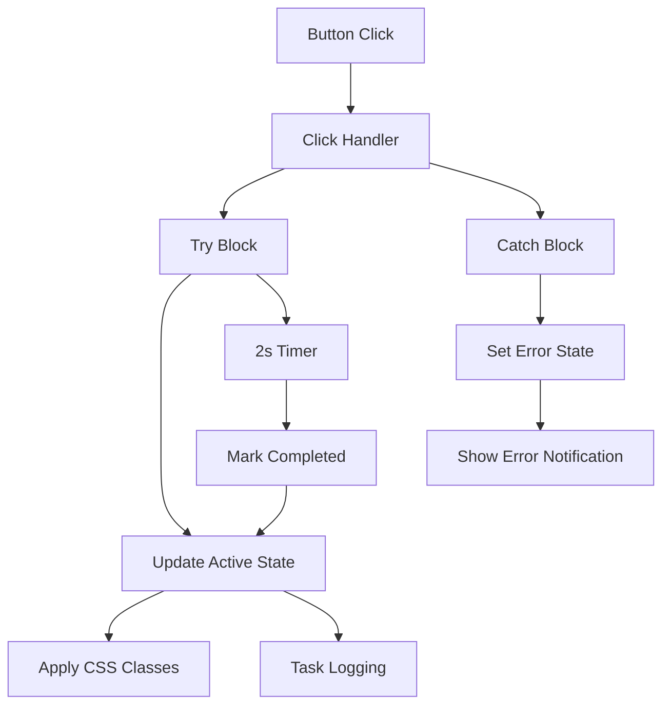

# Architectural Patterns
1. Component Structure:
   - Builders handle UI construction and state transitions
   - Configs manage persistent state and styling rules
   - Notifications system handles unified logging/feedback

2. Button Component Flow:

3. Notification Integration:
   - Centralized task_log_and_notify() handler
   - Color-coded status messages
   - Dual logging (console + UI)
   - Error channel separation
