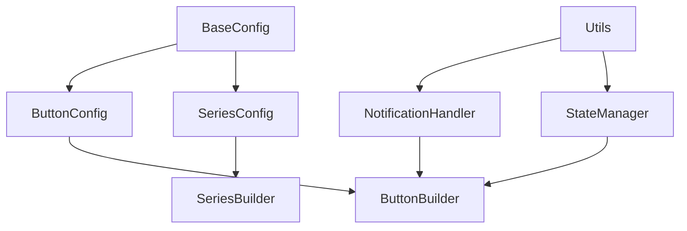
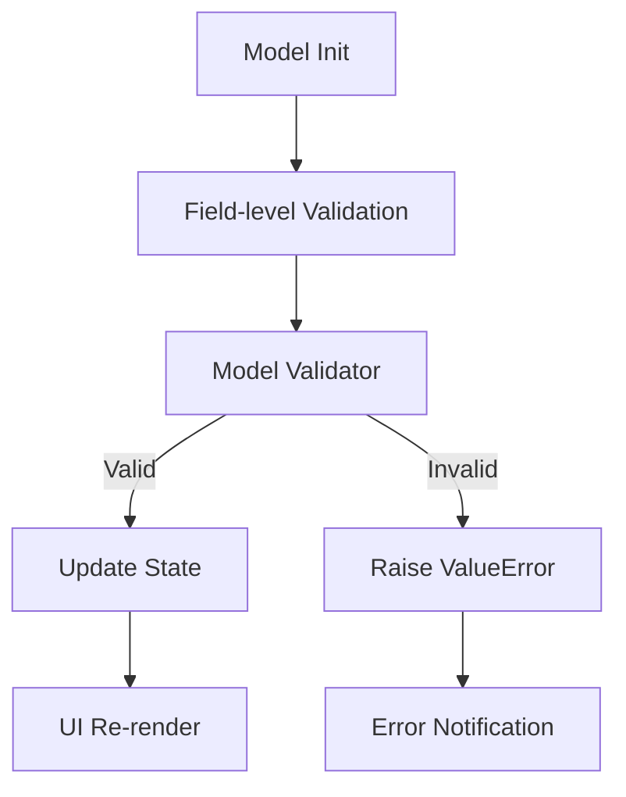

# Architectural Patterns

## Component Relationships

## Validation Workflow

## Notification Integration
- Centralized task_log_and_notify() handler
- Color-coded status messages
- Dual logging (console + UI)
- Error channel separation
