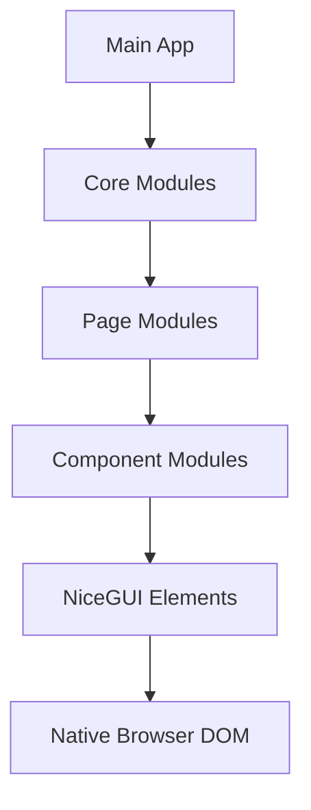
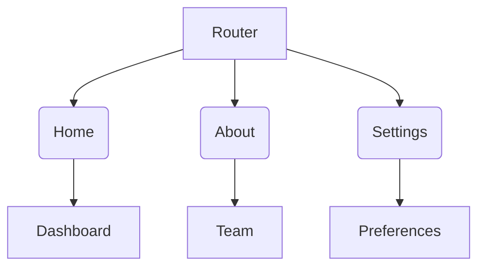

# System Architecture Patterns

## Modular Architecture


## Component Patterns
1. **Module Structure**
```python
# modules/navigation.py
from nicegui import ui

def create_header():
    with ui.header().classes('items-center justify-between'):
        ui.label('App Builder').classes('text-2xl')
        ui.button(icon='menu').props('flat')

def create_drawer():
    with ui.left_drawer().classes('bg-blue-50'):
        ui.button('Dashboard', icon='home')
        ui.button('Templates', icon='design_services')
```

2. **Page Composition**
```python
# pages/dashboard.py
from nicegui import ui
from modules import navigation

def create():
    navigation.create_header()
    navigation.create_drawer()
    with ui.column().classes('p-4 w-full'):
        ui.label('Builder Dashboard').classes('text-h4')
```

## Navigation Implementation


- Route management using `@ui.page` decorators
- Core routing configuration:
```python
# main.py
@ui.page('/')
def home():
    return pages.home.create()

@ui.page('/about')
def about():
    return pages.about.create()

@ui.page('/settings')
def settings():
    return pages.settings.create()
```
- Navigation consistency enforced through BaseLayout class
- Active route highlighting with `ui.link().classes('font-bold')`

## Forbidden Elements
- ❌ Custom CSS classes
- ❌ Inline style attributes
- ❌ Raw HTML components
- ❌ External styling files
