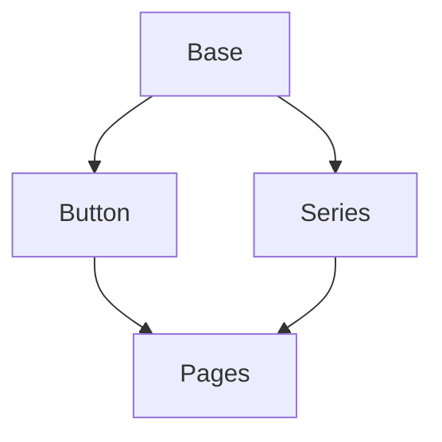
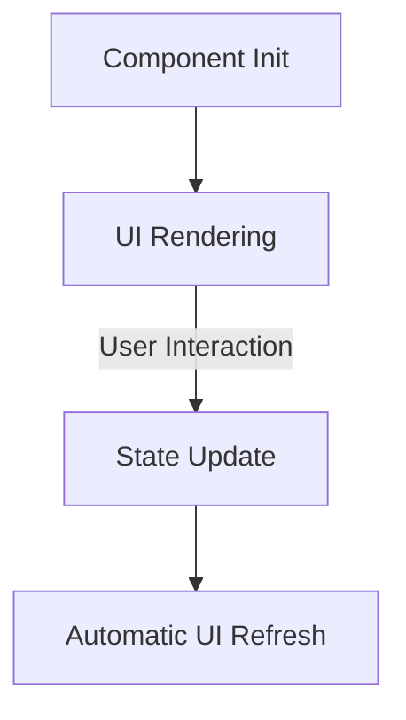

# Architectural Patterns

## Component Relationships

## Configuration Management
- Native niceGUI configuration system
- Default values in component classes
- Runtime customization through UI properties
- Built-in type validation

## UI Element Integration

## Notification Integration
- Centralized task_log_and_notify() handler
- Color-coded status messages
- Dual logging (console + UI)
- Error channel separation
