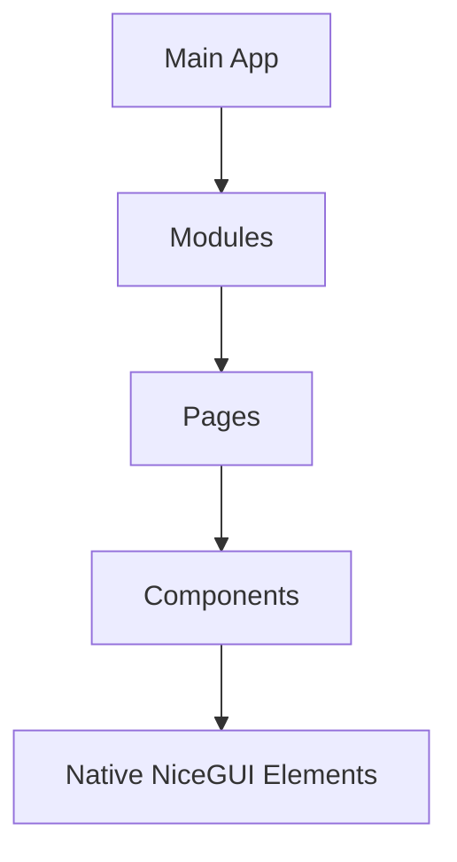

# Technology Stack

## Core Architecture

## Runtime Configuration
- Server port: 8081 (configured in main.py)
- Auto-reload enabled during development
- Production deployment via `uvicorn main:app`

## Implementation Principles
1. Strict module-based organization:
   - `modules/` for reusable UI components
   - `pages/` for route-specific layouts
2. Pure NiceGUI elements only
3. Native theme colors and spacing
4. Built-in responsive grid system
5. Standard NiceGUI typography classes

## Required Patterns
- Page layouts using `ui.header()`, `ui.footer()`, `ui.left_drawer()`
- Component composition with `@ui.refreshable`
- State management through `ui.state()`
- Navigation via `ui.link()` and `ui.page()`

## Forbidden Patterns
- Custom CSS classes
- Inline style attributes
- Raw HTML elements
- External CSS/JS imports
